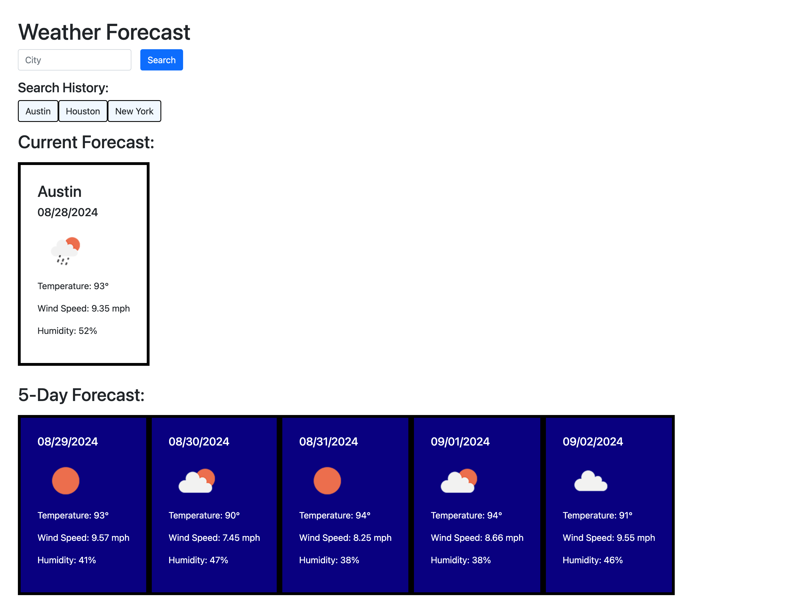

# weather-application

## Description

The purpose of this project was to use the server-side API Open Weather 5 Day Weather Forecast to create a weather dashboard application.

When a user uses the search bar to search for a city, they are presented with a current and five day forecast for that city. Both the current forecast and the five day forecast display an icon representation of the weather and the city’s the temperature, humidity, wind speed.

The application saves each searched city in the form of a button under “search history.” When the user clicks this button, the user is presented with the current and 5 day forecast for that previously searched city. The application utilizes local storage for the search history function.

## Table of Contents

- [Installation](#installation)
- [Usage](#usage)
- [Deployed](#deployed)
- [Credits](#credits)
- [License](#license)

## Usage

## Deployed Application

### Deployed Application URL:

https://karapoole.github.io/weather-application/

### Deployed Application Screenshot:

## Credits

Open Weather Five Day Weather Forecast:
https://openweathermap.org/forecast5

edX curriculum

## License

Please refer to license in repo.
